# Instructions
Afia Ekra [aekra]

**TODO:** Add your screen captures to a new directory called [images](images).

**HINT:** Embed your screen captures as requested in the sections below. You can embed the image using the following syntax:

```

```

Deliverables [50 pts]
For this week, create a new SUBMISSION.md file in your repo. Add the images to a new figures
directory and add links to those images to the SUBMISSION.md file. The images you need are:

5 pts Your Github account showing that is has been forked from the depaulcdm/springpetclinic
repository.
	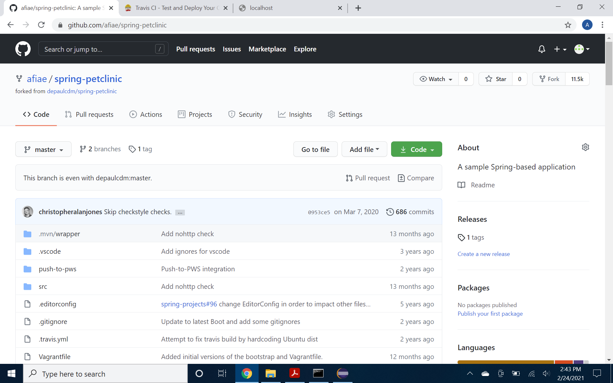
	
5 pts Your Travis CI dashboard showing a successful first build.
	-Note: I may have clicked the 'trigger build' button too many times. #3 is the first build, as I canceld 1 & 2. Sorry!
	

5 pts The section of the POM file showing the coordinates after you’ve changed them.
	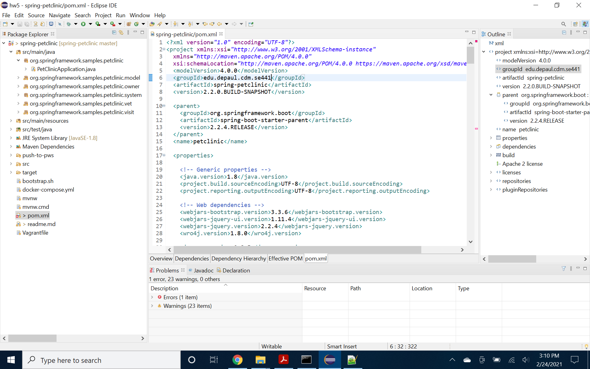
	
5 pts Your Travis CI dashboard showing a successful build after your change of the group
ID.
	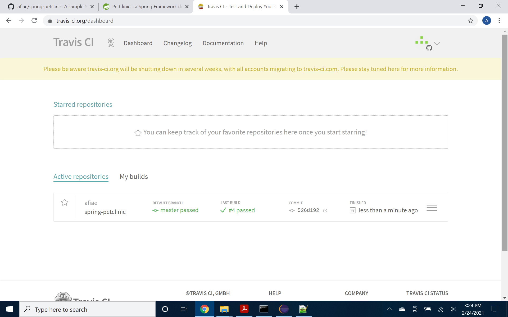
	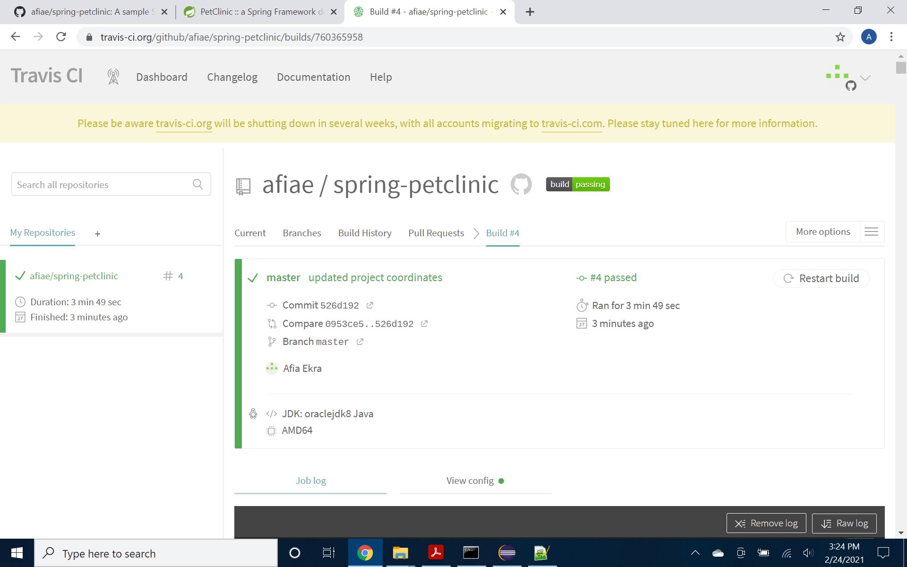

5 pts The section of the POM file showing the coordinates after you’ve commented them
out.
	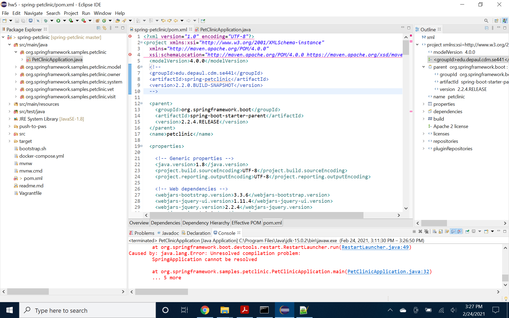
	
5 pts Your Travis CI dashboard showing the unsuccessful build after the breaking change.
	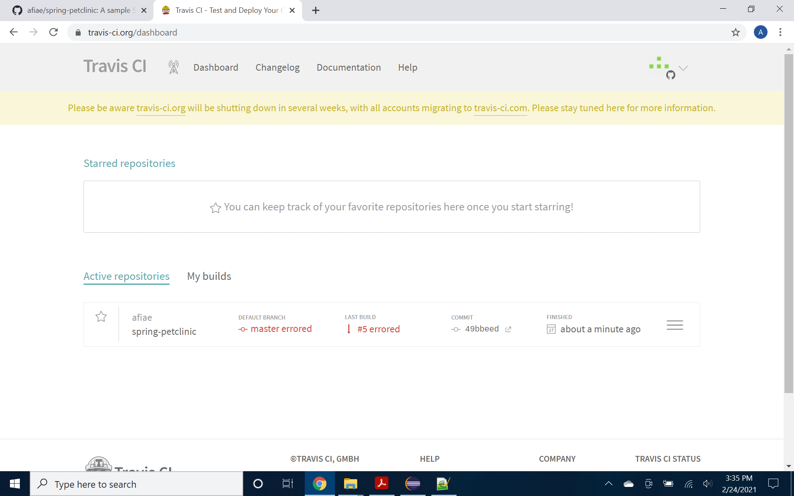
	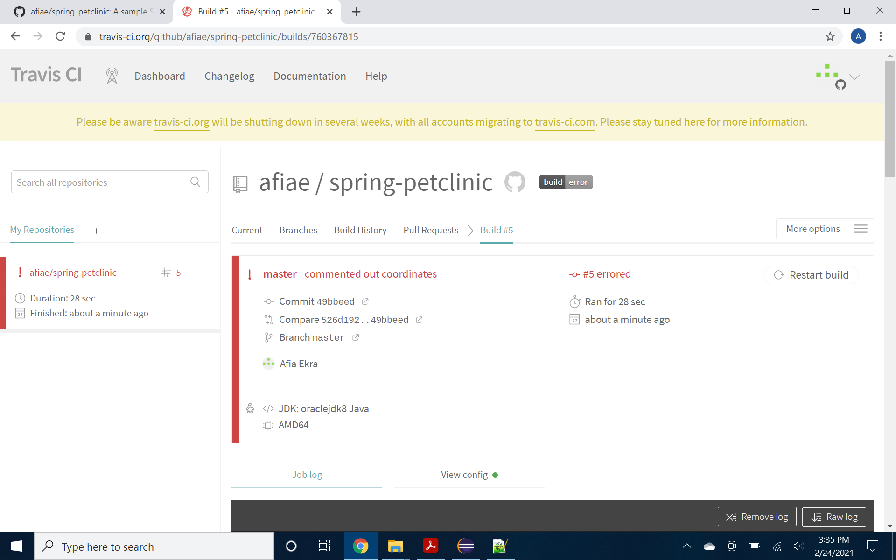

5 pts Your Github repository with the readme.md file selected showing the build failed
status after the Travis CI build fails.
	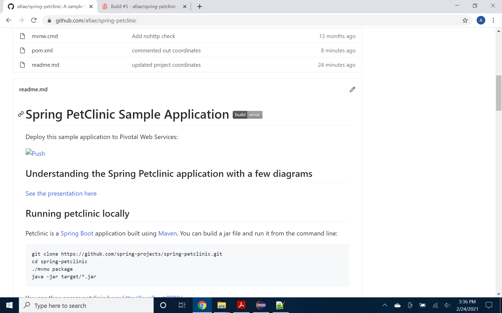

5 pts The section of the POM file showing the coordinates after you’ve fixed them.
	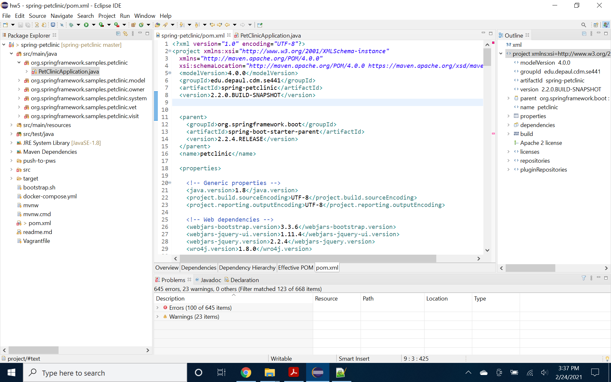

5 pts Your Travis CI dashboard showing the successful build after the breaking change has
been fixed.
	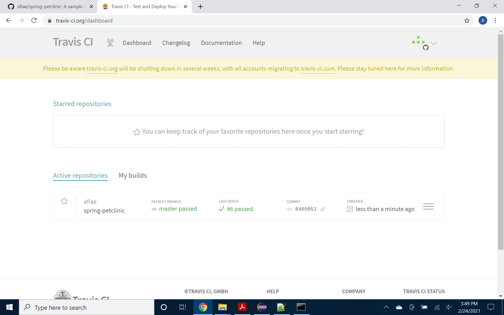
	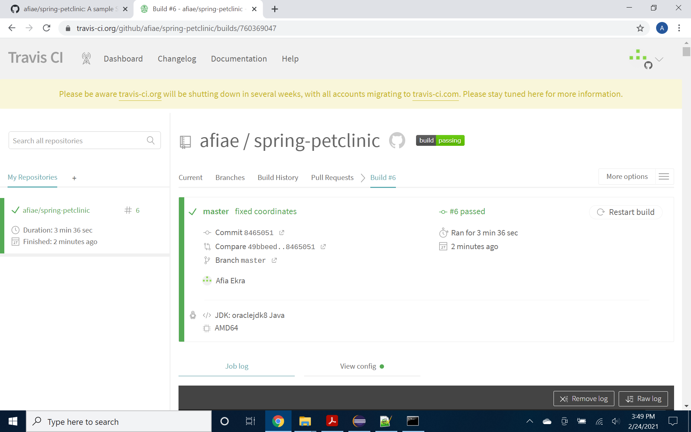

5 pts Your Github repository with the readme.md file selected showing the build success
status after the Travis CI build has recovered.
	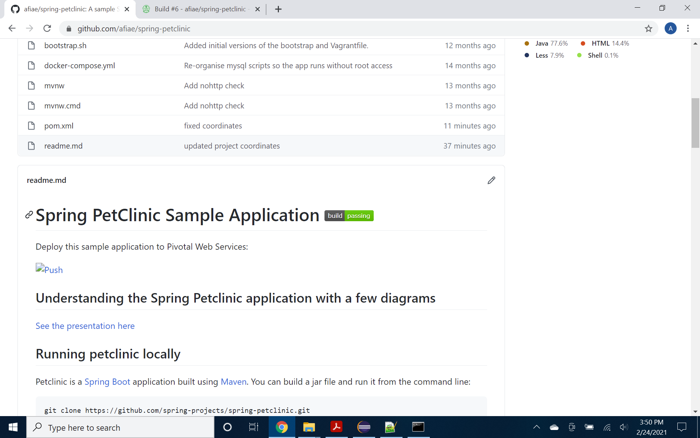
